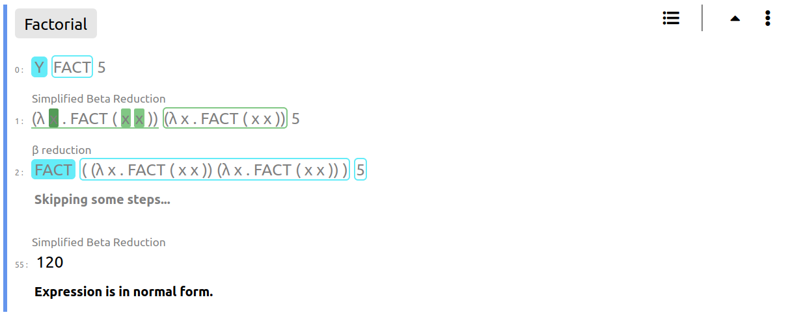

### Hi there 👋

I am John and I am interested in the PL and Type Systems related stuff.

## Some of my favourite work:

[Lambdulus](https://github.com/lambdulus/frontend)

Lambdulus is a tool for learning λ-calculus interactively. It runs online in any modern browser and enables you to to experience λ-calculus as a programming language.



<!--
### Core module of the Lambdulus

[repo](https://github.com/lambdulus/core)

-->

<br>


#### [Frea](https://github.com/Taskkill/frea) - Simple programming language with Damas-Hindley-Milner type inference

```haskell
  let
    zero = (\ n -> (#= (n, 0)))
  in let rec
    fact n =  if (zero n)
              then 1
              else (#* (n, (fact (#- (n, 1)))))
  in (fact 5)
```

<br>

#### [Monolog](https://github.com/Taskkill/monolog) - Small logic programming language inspired by Prolog

```prolog
  plus(z, N, N).
  plus(s(N), M, s(R)) :- plus(N, M, R).
  
  times(z, _, z).
  times(s(N), M, A) :- times(N, M, R), plus(R, M, A).
  
  fact(z, s(z)).
  fact(s(N), R) :- fact(N, PR), times(s(N), PR, R).
```

<br>

#### [SJS](https://github.com/Taskkill/sjs) - Very simple compiler from Lisp-inspired programming language compiled to JS

```lisp
  (define fact (n)
    (if (or (= n 0) (= n 1))
      1
      (* n (fact (- n 1)))
    )
  )
```

<br>

#### [FeenyML](https://github.com/Taskkill/FeenyML) - Interpreter and (incomplete) VM for small programming language inspired by Feeny and ML

```ml
  function fact (num) ->
    if num == 0
    then 1
    else num * fact(num - 1);

  fact(10)
```

<br>

#### [Lambdas](https://github.com/Taskkill/lambdas) - Three simple REPLs of various lambda calculi

```
  [enter λ2 expression]
  :$ (\ a : forall A . A -> A -> A . a) (/ B . (\t : B . (\f : B . t)))
  [command or expression]:$ :type
  :: (forall A . A -> A -> A)
```

<br>

#### [DFSM-DSL](https://github.com/Taskkill/dfsm-dsl) - JS DSL for implementating Deterministic Finite State Machines

```javascript
  let factorial = dfsm`
  state default INIT

  compute
    INIT -> ${(state, num) => num === 0 ? '1' : `${num}`}
      ${(state, num) => num === 0 ? undefined : factorial.compute(num - 1)} .

  compute
    ${state => state === 'INIT' ? 'NO' : state} ->
      ${(state, num) => num === 0 ? state : `${Number(state) * num}`}
      
      ${(state, num) => num === 0 ? state : factorial.compute(num - 1)} .
  `

  factorial.compute(5)
```